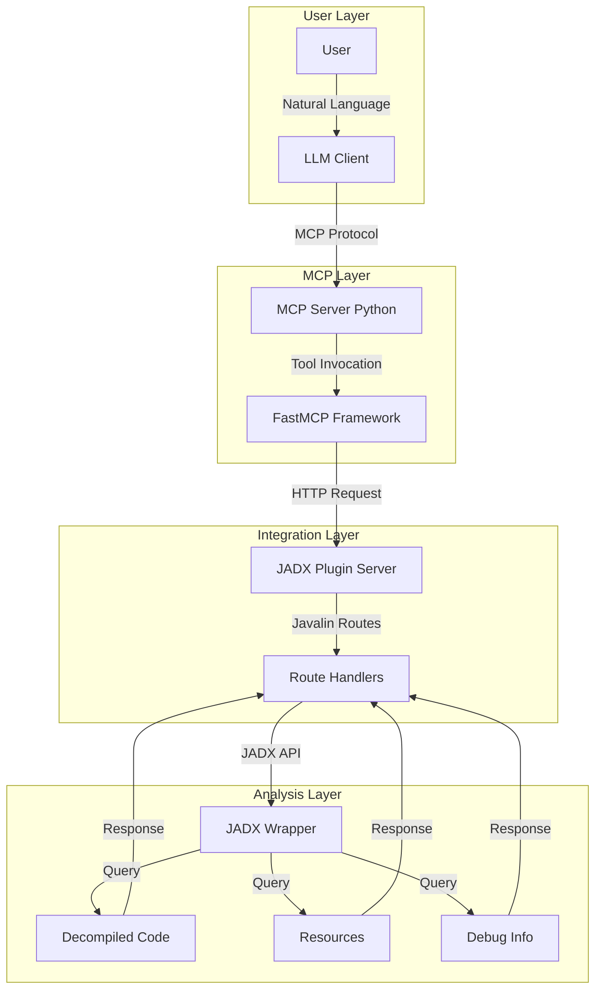

# JADX-AI-MCP Documentation

Welcome to the comprehensive documentation for **JADX-AI-MCP**, an AI-powered Android reverse engineering toolkit that bridges JADX decompiler with Large Language Models through the Model Context Protocol.

## What is JADX-AI-MCP?

JADX-AI-MCP is a sophisticated reverse engineering solution consisting of two tightly integrated components:

1. **JADX-AI-MCP Plugin (Java)** - A JADX-GUI plugin that exposes the decompiler's functionality through a local HTTP API
2. **JADX-MCP-Server (Python)** - An MCP server that translates HTTP endpoints into MCP tools consumable by AI assistants

Together, these components enable real-time, AI-assisted Android application analysis, vulnerability detection, and code understanding.

## Key Features

### Advanced Analysis Capabilities
- **Real-time Code Review**: AI analyzes decompiled code as you navigate
- **Cross-Reference Analysis**: Track method/class/field usage across entire codebases
- **Resource Extraction**: Access manifests, strings, layouts, and resources
- **Smali Analysis**: Low-level bytecode inspection for deep analysis

### Security & Reverse Engineering
- **Vulnerability Detection**: Automated SAST (Static Application Security Testing)
- **Malware Analysis**: Behavioral pattern detection and C2 identification
- **Obfuscation Analysis**: Systematic deobfuscation workflows
- **Permission Auditing**: Identify overprivileged and unused permissions

### Development Assistance
- **Intelligent Refactoring**: AI-assisted renaming of obfuscated classes, methods, fields, variables, and packages
- **Debug Integration**: Runtime variable inspection and stack trace analysis
- **Pagination Support**: Efficient handling of large APKs (10,000+ classes)
- **Multi-Client Support**: Works with Claude, Cherry Studio, LM Studio, Codex
- **Remote Access**: Docker, WSL, and remote VM support via `--host` binding

## Architecture Overview



### Network Architecture

There are **two separate connections** in the system:

```
┌─────────────┐    --host / --port     ┌──────────────────┐   --jadx-host / --jadx-port   ┌──────────────────┐
│  LLM Client │ ◄──────────────────►   │  jadx-mcp-server │ ──────────────────────────►   │  JADX-GUI Plugin │
│  (Claude,   │   Where the MCP server │                  │   Where the MCP server looks  │  (jadx-ai-mcp)   │
│   Codex..)  │   LISTENS for clients  │                  │   for the JADX plugin         │                  │
└─────────────┘                        └──────────────────┘                               └──────────────────┘
```

## Quick Start

### Prerequisites

| Component | Version Required | Purpose |
|-----------|-----------------|---------|
| Java | 11+ | JADX Plugin runtime |
| Python | 3.10+ | MCP Server runtime |
| JADX | 1.5.1+ (r2333+) | Decompilation engine |
| UV | Latest | Python package manager |

### Installation (5 minutes)

```bash
# Step 1: Install JADX Plugin
jadx plugins --install "github:zinja-coder:jadx-ai-mcp"

# Step 2: Download MCP Server
wget https://github.com/zinja-coder/jadx-ai-mcp/releases/latest/download/jadx-mcp-server.zip
unzip jadx-mcp-server.zip

# Step 3: Install UV
curl -LsSf https://astral.sh/uv/install.sh | sh

# Step 4: Run MCP Server
cd jadx-mcp-server
uv run jadx_mcp_server.py

# Step 5: Configure Claude Desktop
# Edit: ~/.config/Claude/claude_desktop_config.json
```

See [Installation Guide](installation.md) for detailed instructions.

## 📚 Documentation Structure

### For Users
- **[Installation Guide](installation.md)** - Complete setup for all platforms
- **[User Guide](user-guide.md)** - Workflows, prompts, and best practices
- **[Examples](examples.md)** - Real-world analysis scenarios

### For Developers
- **[API Reference](api-reference.md)** - Complete tool documentation with examples
- **[Architecture](architecture.md)** - System design and component interaction
- **[Python Module Reference](python-api.md)** - Server-side code documentation
- **[Java Plugin Reference](java-api.md)** - Plugin internals and extension points

### Support
- **[Troubleshooting](troubleshooting.md)** - Common issues and solutions
- **[Contributing](contributing.md)** - Development guidelines

## 🔧 Tool Categories

### Class Analysis Tools (10 tools)
Tools for analyzing decompiled Java classes, methods, and fields.

→ [View Class Tools](api-reference.md#class-analysis)

### Search Tools (3 tools)
Full-text search across classes, methods, and code with advanced scope filtering.

→ [View Search Tools](api-reference.md#search-capabilities)

### Resource Tools (5 tools)
Access to AndroidManifest components, strings, layouts, and resources.

→ [View Resource Tools](api-reference.md#resource-analysis)

### Cross-Reference Tools (3 tools)
Track usage of classes, methods, and fields across codebase.

→ [View Xref Tools](api-reference.md#cross-reference-analysis)

### Refactoring Tools (5 tools)
Rename classes, methods, fields, variables, and packages.

→ [View Refactor Tools](api-reference.md#refactoring)

### Debug Tools (3 tools)
Runtime analysis during JADX debugging sessions.

→ [View Debug Tools](api-reference.md#debugging)

## 🔐 Security & Privacy

- **Secure Defaults**: Server binds to `127.0.0.1` only — remote access must be explicitly enabled
- **No Authentication**: When binding to non-localhost with `--host 0.0.0.0`, traffic is unencrypted and unauthenticated — use only on trusted networks
- **Proxy Isolation**: Internal HTTP requests use `trust_env=False` to prevent proxy interception
- **No Data Collection**: No telemetry or usage tracking
- **Stdio Safety**: Banner and health check output goes to stderr to prevent JSON-RPC stream pollution
- **Open Source**: Fully auditable codebase

!!! warning "Remote Binding"
    When using `--host 0.0.0.0`, the MCP server is accessible to anyone on the network over plain HTTP. Use a firewall or SSH tunnel for remote access.

## Supported Platforms

| Platform | Plugin Support | Server Support | Status |
|----------|---------------|----------------|--------|
| Linux | ✅ Full | ✅ Full | Tested |
| macOS | ✅ Full | ✅ Full | Tested |
| Windows | ✅ Full | ✅ Full | Tested |

## 🤝 Community & Support

- **GitHub Issues**: [Report bugs](https://github.com/zinja-coder/jadx-ai-mcp/issues)
- **GitHub Discussions**: [Ask questions](https://github.com/zinja-coder/jadx-ai-mcp/discussions)

## 📄 License

Apache License 2.0 - See [LICENSE](license.md)

## Acknowledgments

- **JADX Project**: [@skylot](https://github.com/skylot) - Amazing decompiler
- **Anthropic**: Model Context Protocol development
- **FastMCP**: [@jlowin](https://github.com/jlowin) - Python MCP framework

## Next Steps

1. **New Users**: Start with [Installation](installation.md)
2. **Quick Demo**: See [Examples](examples.md)
3. **API Exploration**: Browse [API Reference](api-reference.md)
4. **Contributing**: Read [Contributing Guide](contributing.md)

---

**Current Version**: 6.3.0 | **Last Updated**: March 2026
