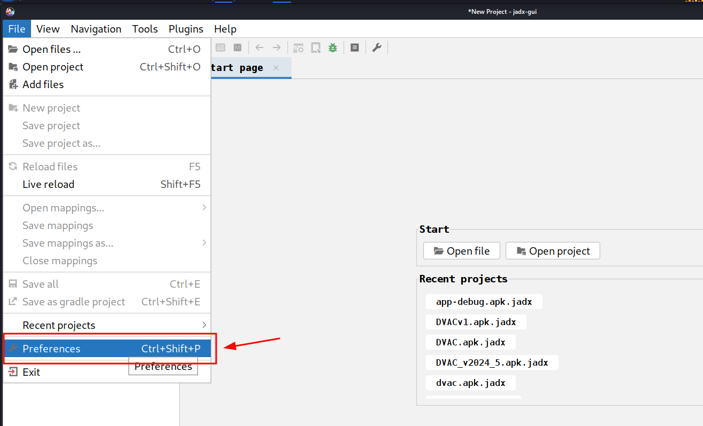

# Installation Guide

This guide covers the complete installation process for JADX-AI-MCP.

## Prerequisites

### System Requirements

- **Operating System**: Windows, macOS, or Linux
- **Java**: Version 11 or higher
- **Python**: Version 3.10 or higher
- **JADX**: Version 1.5.1+ (r2333+)

### Check Prerequisites

```bash
# Check Java version
java -version

# Check Python version
python --version

# Check JADX version
jadx --version
```

## Installation Methods

### Method 1: One-Line Installation (Recommended)

The easiest way to install the plugin:

```bash
jadx plugins --install "github:zinja-coder:jadx-ai-mcp"
```

This command automatically downloads and installs the latest version of the plugin.

### Method 2: Manual Installation via JADX-GUI

1. Download the latest release from [GitHub Releases](https://github.com/zinja-coder/jadx-ai-mcp/releases)
2. Download both:
   - `jadx-ai-mcp-<version>.jar`
   - `jadx-mcp-server-<version>.zip`

3. Open JADX-GUI
4. Navigate to: **Plugins → Install Plugin**
5. Select the downloaded `.jar` file
6. Restart JADX-GUI



### Method 3: Build from Source

```bash
# Clone the repository
git clone https://github.com/zinja-coder/jadx-ai-mcp.git
cd jadx-ai-mcp

# Build the plugin
./gradlew build

# The built JAR will be in build/libs/
# Install it using Method 2 above
```

## MCP Server Setup

### Step 1: Extract Server Files

```bash
# Download server package
wget https://github.com/zinja-coder/jadx-ai-mcp/releases/latest/download/jadx-mcp-server.zip

# Extract
unzip jadx-mcp-server.zip
cd jadx-mcp-server
```

### Step 2: Install UV Package Manager

UV is a fast Python package manager used by this project:

```bash
# Linux/macOS
curl -LsSf https://astral.sh/uv/install.sh | sh

# Windows (PowerShell)
powershell -c "irm https://astral.sh/uv/install.ps1 | iex"
```

### Step 3: Verify Installation

```bash
# Check UV installation
uv --version

# Test server (should show usage info)
uv run jadx_mcp_server.py --help
```

### Optional: Create Virtual Environment

```bash
# Create venv (optional but recommended for troubleshooting)
uv venv
source .venv/bin/activate  # Linux/macOS
# OR
.venv\Scripts\activate  # Windows

# Install dependencies manually
uv pip install httpx fastmcp
```

## LLM Client Configuration

### Claude Desktop

#### Linux Configuration

```bash
# Edit config file
nano ~/.config/Claude/claude_desktop_config.json
```

#### Windows Configuration

Location: `%APPDATA%\Claude\claude_desktop_config.json`

#### macOS Configuration

Location: `~/Library/Application Support/Claude/claude_desktop_config.json`

#### Configuration Content

```json
{
  "mcpServers": {
    "jadx-mcp-server": {
      "command": "/path/to/uv",
      "args": [
        "--directory",
        "/path/to/jadx-mcp-server/",
        "run",
        "jadx_mcp_server.py"
      ]
    }
  }
}
```

**Important**: Replace paths with absolute paths on your system.

#### Find UV Path

```bash
# Linux/macOS
which uv

# Windows
where uv
```

### Alternative: Install as UV Tool

```bash
# Install globally as a UV tool
uv tool install git+https://github.com/zinja-coder/jadx-mcp-server

# Then use simplified config
{
  "mcpServers": {
    "jadx-mcp-server": {
      "command": "jadx_mcp_server"
    }
  }
}
```

### Cherry Studio Configuration

1. Open Cherry Studio settings
2. Navigate to MCP configuration
3. Add new MCP server:
   - **Type**: stdio
   - **Command**: `uv`
   - **Arguments**:
     ```
     --directory
     /path/to/jadx-mcp-server
     run
     jadx_mcp_server.py
     ```

### LM Studio Configuration

1. Open LM Studio
2. Navigate to MCP settings
3. Edit `mcp.json`:

```json
{
  "mcpServers": {
    "jadx-mcp-server": {
      "command": "/path/to/uv",
      "args": [
        "--directory",
        "/path/to/jadx-mcp-server",
        "run",
        "jadx_mcp_server.py"
      ]
    }
  }
}
```

## Remote & Custom Configuration

### CLI Flags Reference

There are **two separate connections** and each has its own host/port.

```
┌─────────────┐    --host / --port     ┌──────────────────┐   --jadx-host / --jadx-port   ┌──────────────────┐
│  LLM Client │ ◄──────────────────►   │  jadx-mcp-server │ ──────────────────────────►   │  JADX-GUI Plugin │
│  (Claude,   │   Where the MCP server │                  │   Where the MCP server looks  │  (jadx-ai-mcp)   │
│   Codex..)  │   LISTENS for clients  │                  │   for the JADX plugin         │                  │
└─────────────┘                        └──────────────────┘                               └──────────────────┘
```

| Flag | Default | Controls |
|------|---------|----------|
| `--http` | off | Use HTTP transport instead of stdio |
| `--host` | `127.0.0.1` | **Where the MCP server listens** (bind address for LLM clients) |
| `--port` | `8651` | **Which port the MCP server listens on** |
| `--jadx-host` | `127.0.0.1` | **Where to find the JADX plugin** (the target JADX-GUI machine) |
| `--jadx-port` | `8650` | **Which port the JADX plugin is on** |

### HTTP Stream Mode (Optional)

Run the server in HTTP mode for remote access from an LLM client:

```bash
# Default HTTP mode (localhost:8651)
uv run jadx_mcp_server.py --http

# Custom port
uv run jadx_mcp_server.py --http --port 9999
```

### Remote / Docker / WSL Access

To make the MCP server accessible from other machines (e.g., if you run the MCP server in Docker, or via WSL, and the LLM client is on the host Windows machine):

```bash
# Bind to all interfaces
uv run jadx_mcp_server.py --http --host 0.0.0.0

# Bind to all interfaces on a custom port
uv run jadx_mcp_server.py --http --host 0.0.0.0 --port 9999
```

!!! danger "Security Warning — Remote Binding"
    When using `--host 0.0.0.0` (or any non-localhost address), the MCP server binds to **all network interfaces** over **plain HTTP with no authentication**.
    - **Anyone on the network** can connect and invoke all MCP tools.
    - There is **no TLS encryption** — traffic can be intercepted.
    - An attacker can use the server to read decompiled code, modify it, and access debug info.
    - **Mitigation:** Only bind to `0.0.0.0` on trusted, isolated networks (e.g., Docker bridge), use a firewall, or tunnel via SSH.

### Remote JADX Plugin Configuration

If the JADX AI MCP Plugin is running on a **different machine** (e.g., JADX on a remote VM, MCP server on your local host), use the `--jadx-host` option:

```bash
# Connect to JADX plugin on a remote host
uv run jadx_mcp_server.py --jadx-host 192.168.1.100 --jadx-port 8650
```

### Custom Plugin Port Configuration

If you change the JADX-GUI Plugin port:

1. Open JADX-GUI with the plugin installed
2. Navigate to: **Plugins → JADX-AI-MCP → Configure Port**
3. Enter desired port (default: 8650)
4. Click **Restart Server**


When using custom plugin port:

```bash
# Connect to plugin on custom port
uv run jadx_mcp_server.py --jadx-port 8652
```

Update LLM client configuration appropriately:

```json
{
  "mcpServers": {
    "jadx-mcp-server": {
      "command": "/path/to/uv",
      "args": [
        "--directory",
        "/path/to/jadx-mcp-server/",
        "run",
        "jadx_mcp_server.py",
        "--jadx-host",
        "192.168.1.100",
        "--jadx-port",
        "8652"
      ]
    }
  }
}
```

## Verification

### 1. Check Plugin Status

1. Open JADX-GUI
2. Load any APK file
3. Check: **Plugins → JADX-AI-MCP → Server Status**
4. Should show: "Server Running on port 8650"

### 2. Check MCP Server Connection

1. Open your LLM client (Claude/Cherry Studio/LM Studio)
2. Look for hammer icon (🔨) or MCP tools indicator
3. Click and verify "jadx-mcp-server" is listed
4. Should show ~30 available tools

### 3. Test Basic Functionality

Run this prompt in your LLM client:

```
List all available JADX MCP tools
```

Expected response: List of 30+ tools including `fetch_current_class`, `get_android_manifest`, etc.
