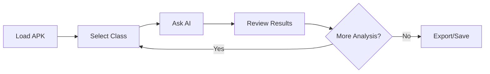

# User Guide

Complete guide to using JADX-AI-MCP for Android reverse engineering with AI assistance.

## Getting Started

### Initial Setup

1. **Launch JADX-GUI** with an APK loaded
2. **Start your LLM client** (Claude Desktop, Cherry Studio, or LM Studio)
3. **Verify connection** - Look for the hammer icon (🔨) in your LLM client

### Basic Workflow



## Core Features

### 1. Class Analysis

#### Fetching Current Class

Select any class in JADX-GUI and ask:

```
Fetch the currently selected class and analyze it for security issues
```

**What happens:**
- Plugin captures selected class
- Sends decompiled source to LLM
- AI performs SAST (Static Application Security Testing)
- Returns vulnerability report

#### Get Specific Class

```
Get the source code for class com.example.app.MainActivity
```

**Use cases:**
- Analyze specific components
- Compare class implementations
- Track obfuscated classes

### 2. Code Search

#### Search by Method Name

```
Search for all methods named "encrypt" across the application
```

**Returns:**
- All classes containing matching methods
- Method signatures
- Locations in codebase

#### Search by Keyword

```
Search for classes containing the keyword "password"
```

**Useful for:**
- Finding credential handling code
- Locating encryption routines
- Identifying API endpoints

#### Scoped Search

```
Search for "http://" only in strings, within the "com.example.network" package
```

**Scope options:**
- `all` (default)
- `code`
- `comments`
- `strings`

#### Pagination Support

For large results:

```
Search for classes containing "crypto" with pagination offset=0 count=20
```

### 3. Resource Analysis

#### Android Manifest

```
Analyze the AndroidManifest.xml for security issues
```

**Checks:**
- Dangerous permissions
- Exported components
- Intent filters
- Debug flags

#### Specific Manifest Components

```
Get all exported Activities from the Manifest
```

**Use cases:**
- Deep dive into Specific Components (Activities, Services, Receivers, Providers)
- Finding unprotected endpoints

#### Strings Extraction

```
Get all strings from strings.xml files
```

**Use cases:**
- Find hardcoded secrets
- Identify API endpoints
- Extract user-facing text

#### Resource Files

```
List all resource files in the APK
```

```
Get the content of res/layout/activity_main.xml
```

### 4. Cross-Reference Analysis (Xrefs)

#### Find Class References

```
Find all references to class com.example.crypto.AES
```

**Shows:**
- Where class is instantiated
- Constructor calls
- Static method invocations

#### Find Method References

```
Find all references to method encryptData in class CryptoHelper
```

**Reveals:**
- Call sites
- Usage patterns
- Data flow

#### Find Field References

```
Find all references to field API_KEY in class Config
```

**Identifies:**
- Read operations
- Write operations
- Potential leaks

### 5. Refactoring

#### Rename Class

```
Rename class a.b.c to com.example.crypto.AESEncryption
```

**Benefits:**
- Improves code readability
- Aids understanding
- Simplifies analysis

#### Rename Method

```
Rename method a() in class Helper to decryptPassword()
```

#### Rename Variable

```
Rename variable 'str' locally inside method 'loadConfig' to 'apiKey'
```

**Benefits:**
- Simplifies complex function analysis
- Cleans up minified code

#### Rename Package

```
Rename package a.b to com.example.utils
```

**Batch operation:** Renames all classes in the package

### 6. Debugging Support

#### Stack Frames

```
Get current stack frames from the debugger
```

**Requirements:**
- JADX debugger must be active
- Breakpoint hit

#### Thread Analysis

```
Get all threads from the debugged process
```

**Shows:**
- Thread names
- Thread states
- Thread priorities

#### Variable Inspection

```
Get variables from the current debugging context
```

**Displays:**
- Local variables
- Instance variables
- Variable values

## Advanced Usage

### Security Analysis Workflows

#### Vulnerability Scanning

```
Perform a comprehensive security analysis:
1. Get the AndroidManifest and check for dangerous permissions
2. Search for classes containing "WebView"
3. Analyze WebView usage for JavaScript injection vulnerabilities
4. Search for hardcoded credentials in all classes
5. Provide a summary report
```

#### Data Flow Analysis

```
Trace data flow for sensitive information:
1. Find all references to getUserPassword method
2. For each reference, get the calling method's source
3. Analyze how password is handled
4. Identify potential security issues
```

### Obfuscation Analysis

#### Deobfuscation Strategy

```
Help me deobfuscate this app:
1. Get main application classes
2. Identify naming patterns (a.b.c vs meaningful names)
3. Suggest descriptive names based on functionality
4. Rename classes systematically
```

#### Pattern Recognition

```
Analyze the obfuscation technique:
1. Get list of all classes
2. Identify obfuscation patterns
3. Determine obfuscator type (ProGuard/R8/DexGuard)
4. Suggest deobfuscation approach
```

### Large APK Analysis

#### Pagination Strategy

```
Analyze all classes efficiently:
1. Get total class count
2. Fetch classes in batches of 50
3. For each batch, identify interesting classes
4. Deep dive into flagged classes
```

#### Selective Analysis

```
Focus on high-risk components:
1. Get main activity class
2. Get all application package classes
3. Search for network-related classes
4. Analyze only crypto and auth classes
```
